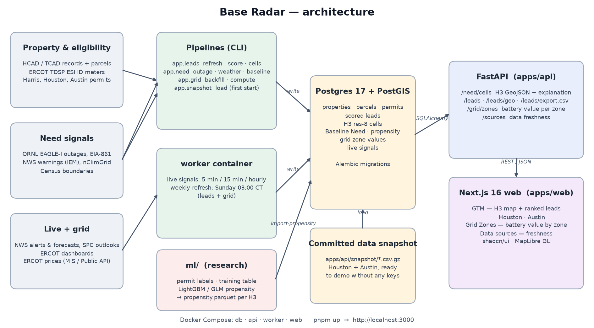
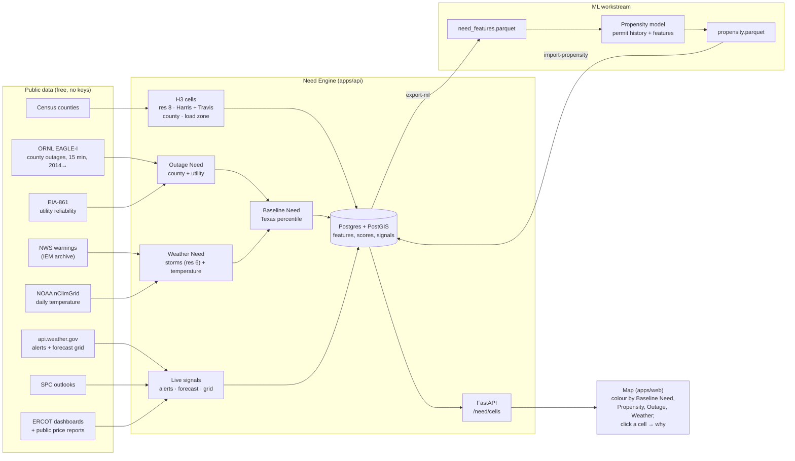

# Base Radar: where to sell home backup power next

**Base Radar** turns public data into a ranked, street-level go-to-market map for
[Base Power](https://basepowercompany.com): where Base can serve, where backup power matters
most, and which homes are most likely to adopt.

**Demo video:** _Loom link — added at submission_ · **Repo:** https://github.com/Sumlabs-AI/bp-gtm ·
**Run it:** `pnpm install && pnpm up`, then open http://localhost:3000 (real data loads on first start)



## Summary

Base Radar turns public data into a ranked, street-level go-to-market map for Base Power. It helps
answer three questions: where Base can serve, where backup power matters most, and which homes are
most likely to adopt.

The platform combines property records, permits, outage history, severe-weather exposure and ERCOT
market data into one decision workflow. Property and parcel data identify eligible homes and support
installability screening. Outage and weather signals quantify structural backup-power need. City
permits show where generators, batteries and Base Power systems have already been installed.
Additional health data from CDC PLACES and HHS emPOWER is analyzed only at area level, never to
identify individuals.

Today, Base Radar covers Houston and Austin, with more than 900,000 properties in the product
dataset. Homes are connected to a common H3 geographic grid, allowing Base to move from
market-level signals to ranked neighborhoods and individual properties.

Our Austin research found that local home value is the strongest adoption signal tested. Homes
above $1.5M purchased backup power approximately 38× more often than homes below $300k, while Base
Power's 2026 buyers skewed below traditional generator buyers in home value. That creates a
potentially attractive middle-high-value segment: roughly 36,000 installable Austin homes between
$800k and $1.5M without an existing backup installation, corresponding to approximately 1,300
expected buyers if observed adoption rates persist.

Each lead can then be inspected with its address, estimated electricity use, suggested battery
size, area-level backup need and the factors driving its ranking.

## Team

| Name | Role | GitHub |
| --- | --- | --- |
| Marc-Antoine Cayer | Full-stack engineering (backend & frontend): Need Engine, live grid and weather signals, GTM map, ML contract | [@macayer](https://github.com/macayer) |
| Romain Chaudron | Backend & machine learning: permit labels, propensity model, Opportunity Score, data snapshot | [@chaudronmagic](https://github.com/chaudronmagic) |
| Matthieu Berger | Frontend & product engineering: sales-first UI, leads experience, battery value and electricity use per lead | [@mamalovesyou](https://github.com/mamalovesyou) |
| Henry Heckmann | Project lead: organization, coordination and submission | — |
| Igor Eduardo | Data lead: GTM datasets (Census, parcels, permits, health) and market research | [@nomad-link-id](https://github.com/nomad-link-id) |

## Quick start

Prerequisites: Docker, Node 22+ with pnpm 10 (`corepack enable`). No API keys are needed.

```bash
git clone https://github.com/Sumlabs-AI/bp-gtm.git && cd bp-gtm
pnpm install
cp .env.example .env      # optional ERCOT Public API credentials; leave empty for the demo
pnpm up                   # web http://localhost:3000 · API http://localhost:8000/docs
```

On first start the API loads the committed data snapshot (`apps/api/snapshot/`: Houston and Austin
homes, leads, H3 cell scores, grid values) into the empty database, so the app shows real data
without running any pipeline. The `worker` service then keeps live signals fresh (NWS alerts and
ERCOT conditions every 5 min, prices every 15 min, forecasts hourly).

## Reproduce the demo

1. `pnpm up` and open http://localhost:3000 (redirects to **GTM**).
2. **GTM** — switch the market between Houston and Austin; colour the H3 cells by Baseline Need,
   Propensity, Outage Need or Weather Need; click a cell to filter the ranked leads beside the map.
3. Open a lead: address, suggested battery size, estimated electricity use, installability, the
   area's backup need and the factors behind its rank. Export the list as CSV.
4. **Grid Zones** — battery value by ERCOT load zone. **Data sources** — freshness of every input.

Environment variables (`.env.example`): only the optional ERCOT Public API credentials
(`ERCOT_USERNAME`, `ERCOT_PASSWORD`, `ERCOT_PRIMARY_KEY`, `ERCOT_SECONDARY_KEY`) for the most recent
days of prices. Everything else uses public endpoints with no key. To rebuild the data from source
instead of the snapshot, see [Rebuild the data](#rebuild-the-data-from-source).

## Tech stack

| Layer | Technology |
| --- | --- |
| Web | Next.js 16, React 19, Tailwind CSS 4, shadcn/ui, MapLibre GL, Recharts |
| API | FastAPI, SQLAlchemy 2, Alembic, Python 3.13 (uv), pandas, GeoPandas, DuckDB, H3 |
| Database | Postgres 17 + PostGIS |
| Jobs | `worker` container (weekly refresh + live signals); CLIs `python -m app.grid`, `app.leads`, `app.need` |
| ML | `ml/` (separate uv project): LightGBM and GLM propensity, exported per H3 cell |
| Runtime | Docker Compose (db, api, worker, web) |

## Data and provenance

All inputs are public; the full list of endpoints and licences is in [Data sources](#data-sources).

| Domain | Sources |
| --- | --- |
| Homes | Harris Central Appraisal District (HCAD) records and parcels; Travis Central Appraisal District (TCAD) records and parcels |
| Eligibility | ERCOT TDSP ESI ID extract (active residential meters) |
| Adoption | Harris County, City of Houston and City of Austin building permits |
| Need | ORNL EAGLE-I outages, EIA-861 reliability, NWS warnings (IEM), NOAA nClimGrid, NWS API, SPC outlooks |
| Grid | ERCOT price reports and dashboards |
| Geography | US Census boundaries, ERCOT load zones, HIFLD territories, H3 |
| Research datasets | Census ACS 2020–2024, CDC PLACES 2025, HHS emPOWER, TCAD, Travis County building footprints, City of Austin permits — see [`datasets/`](datasets/README.md) |

The committed snapshot contains computed product data only: no owner names or mailing addresses.
The GTM research datasets in [`datasets/`](datasets/README.md) are © 2026 Igor Eduardo: free for
the hackathon team's project; the sponsor and third parties need a written license.

## Known limitations and next steps

**Limitations**
- Two markets (Harris and Travis counties); co-op territories are not covered by the ERCOT meter
  extract.
- Home value remains the strongest adoption signal; the propensity models tie it but do not beat it
  yet (see [`ml/README.md`](ml/README.md)).
- The electricity-use estimate is calibrated on Houston homes; Austin homes lack living area in the
  public parcel layer.
- Temperature uses dry-bulb data, so Houston's humid heat is under-counted (backlog #21).
- Outage history is county-level: every cell in a county shares it.
- Utility reliability is known only for CenterPoint and Austin Energy.
- Live signals are observed, not scored.
- The reference population is area-weighted ("% of Texas land"), not customer-weighted.
- Appraisal and permit data have no explicit reuse licence: get Base legal sign-off before
  exporting lead data outside the team.

**Next steps**
- Add San Antonio and Dallas–Fort Worth (parcels for 22 counties are already prepared in `ml/`).
- Home-level propensity with parcel features, and product-specific models (generator vs battery).
- Score live signals into a "why now" Timing factor for the Opportunity Score.
- Heat-index history (#21) and within-county outage detail from satellite night lights.
- Push ranked leads to Base's CRM.

---

## The big picture

A GTM decision needs three independent answers. We keep them separate on purpose: each one
is useful on its own, and a single blended number would hide *why* an area matters.

```text
   BASELINE NEED                PROPENSITY                    LIVE NEED
   "Would a battery be          "Who is likely to buy?"       "Why now?"
    structurally useful here?"
          │                          │                            │
   outage history,            permit history +            NWS alerts, forecasts,
   weather exposure           static Need features        ERCOT grid conditions
   (this repo)                (ML workstream)             (this repo)
          │                          │                            │
          └──────────────────────────┼────────────────────────────┘
                                     ▼
                              GTM OPPORTUNITY
                        "Who should Base target now?"
                     (the final combination, decided last)
```

| Need 95 / Propensity 20 | Need 35 / Propensity 95 | Need 90 / Propensity 90 + live event |
| --- | --- | --- |
| a battery would help a lot, but an unlikely buyer: educate | a likely buyer, weak product-need story | target now |

Everything joins on one geographic key: an **H3 cell**.

## How it works



### 1. One geography for everything: H3 cells

External data comes in incompatible shapes (county polygons, utility territories, NWS alert
polygons, weather grids, permit addresses). Instead of joining each one to every other, we
normalise all of it onto **H3 resolution-8 hexagons** (~0.74 km²): the unit of computation
and the join key shared with the ML model.

```text
county / load zone / alert polygon / forecast grid / permit address
                          │
                          ▼   (PostGIS + the H3 library)
                     H3 res-8 cell  ──►  8,715 cells: Harris (Houston) + Travis (Austin)
                          │
            ┌─────────────┴─────────────┐
      Need features                Propensity
```

Each cell knows its **county** and **ERCOT load zone** (assigned by the cell's centre, with
the same rule the leads use, so a lead and its cell never disagree). Storm exposure is
computed on a coarser statewide **res-6 grid** (~36 km², 16,697 cells covering Texas) that
also serves as the reference population for every percentile.

### 2. Baseline Need: the structural case

Every score is a **Texas percentile** ("more than X% of Texas"), never a scale invented for
two counties. Raw numbers sit next to every percentile so a salesperson can quote them.

| Component | Sub-score | Measures | Source | Grain |
| --- | --- | --- | --- | --- |
| **Outage Need** | Observed Outage Exposure | outage hours per customer, 5 years | ORNL EAGLE-I | county |
| | Utility Reliability Need | SAIDI excluding major events, 5-year mean | EIA-861 | utility |
| **Weather Need** | Storm Exposure | days under severe-thunderstorm / tornado / extreme-wind warnings | NWS via IEM | res 6 |
| | Temperature Extremes | days ≥ 100 °F and ≤ 28 °F, measured | NOAA nClimGrid | county |

**Baseline Need** combines Observed Outage Exposure (O) and Weather Need (W) with a
union-style rule, then ranks the result against all 16,697 Texas res-6 cells:

```text
raw = 100 × (1 − (1 − O/100) × (1 − W/100))        "at least one strong structural reason"
Baseline Need = percentile of raw across Texas       plus the dominant driver: outage / weather / both
```

Three design decisions came from measuring, not guessing (details in the wiki):

- **Measured temperature, not NWS heat/cold advisories.** Across 254 Texas counties,
  advisory counts don't track measured extremes (rank correlation −0.29 for heat), and the
  issuing NWS office explains 85% of their variance. Storm *warnings* do track severe
  weather reports (0.76), so those are used.
- **Outage hours per customer, not "major event" counts.** Event counts fall as county
  size grows (one feeder fault is 5% of a small county), which put Harris at the 9th
  percentile. Hours per customer is size-normalised and cross-checks with EIA's SAIDI.
- **Union, not mean.** Outage and weather exposure are *complementary* across Texas
  (rank correlation −0.38: the coast is outage-heavy, the Panhandle weather-heavy). A mean
  would push those one-sided places to the middle.

### 3. Live signals: the "why now"

Live data is **observed and stored, but not yet scored**: the scoring rule will be decided
from real collected overlaps, not invented from a quiet afternoon. Two rules hold everywhere:

- **Official and derived are never shown as equivalent.** An NWS Tornado Warning or an
  ERCOT Energy Emergency Alert is official. "Wind gusts ≥ 58 mph forecast tomorrow" or
  "reserves below 3,000 MW" is *our* reading of NWS/ERCOT data, labelled as such (solid red
  vs dashed amber on the map).
- **Whether a signal is active is decided at read time**, with an explicit clock: an alert
  ending at 15:30 simply stops matching at 15:30. Nothing needs cleaning up, and every
  signal is kept for history.

| Signal | Kind | Source | Refresh |
| --- | --- | --- | --- |
| NWS Alerts (tornado, severe storm, tropical, winter, heat, cold) | official | api.weather.gov | 5 min |
| Forecast Signals (wind, heat index, cold, ice; SPC severe-storm outlook), next 48 h | derived | NWS forecast grid, SPC | hourly |
| ERCOT Grid Condition (Normal / Conservation / EEA 1–3) | official | ERCOT dashboard | 5 min |
| Grid Stress Signals (low reserves, tight margin, real-time / day-ahead price spikes) | derived | ERCOT dashboards + public price reports | 5–15 min |

Failures never erase good data: a failed fetch is logged, the last successful state stays,
and it is flagged **stale** after a set time.

### 4. The ML handoff

The Need Engine and the propensity model are decoupled by two boring files, both keyed by
`h3_index` and stamped with a `feature_version` ([wiki/ml-contract.md](wiki/ml-contract.md)):

```text
Need Engine ── need_features.parquet ──────────► Propensity model ── propensity.parquet ──► Need Engine
               (1 row per cell: geography,          (permit history +      (h3_index, score 0–100,
                raw history, scores, versions)       static features)       model_version, scored_at)
```

**The propensity model receives static, historical features only.** Live weather and grid
signals change hour to hour; they would let a model "explain" a 2023 permit with today's
heat forecast. They are combined downstream, later, with Baseline Need and Propensity into
GTM Opportunity.

## What it shows today

| | Houston (Harris) | Austin (Travis) |
| --- | --- | --- |
| Observed Outage Exposure | 76 (118 outage hours per customer in 5 years; Uri, the 2024 derecho and Beryl are all detected) | 52 |
| Storm Exposure | 20–76 across the county (NW Houston highest) | 22–48 |
| Temperature Extremes | 8 (dry-bulb only: humid heat is under-rated, see limitations) | 47 |
| Baseline Need | 36–59, driven by outage history | 21–30 |

The stormiest cells in Texas are around Amarillo; the highest outage exposure is on the Gulf
Coast. On a quiet day the live panel is empty by design; the worker keeps collecting.


## Data sources

Every external endpoint the code calls. All are public; only the optional ERCOT Public API
needs an account. Raw downloads are cached under `apps/api/data/` (gitignored).

### Need Engine (GTM map cells and live signals)

| Source | What we use it for | Endpoint | Access / licence | Refresh |
| --- | --- | --- | --- | --- |
| **ORNL EAGLE-I** | County customers-out every 15 min, 2021–2025 → Outage Events, outage hours per customer | `https://api.figshare.com/v2/articles/24237376` (file list; each file via its `download_url`, plus `MCC.csv` modeled customers) | none · CC BY 4.0 | manual (`outage download`); ~2 months after year end |
| **EIA Form 861** | Utility SAIDI/SAIFI (reliability) 2020–2024 | `https://www.eia.gov/electricity/data/eia861/zip/f861{year}.zip`, older years `…/eia861/archive/zip/f861{year}.zip` | none · public domain | manual; yearly |
| **NWS warnings (Iowa Environmental Mesonet archive)** | Severe thunderstorm / tornado / extreme wind warning polygons → Storm Exposure | `https://mesonet.agron.iastate.edu/cgi-bin/request/gis/watchwarn.py?accept=shapefile&states=TX&limit1=yes&sts=…&ets=…` | none · public domain (NWS) | manual (`weather download`) |
| **NOAA nClimGrid-daily (EpiNOAA)** | Daily county max/min temperature → days ≥ 100 °F / ≤ 28 °F | `https://noaa-nclimgrid-daily-pds.s3.amazonaws.com/EpiNOAA/v1-0-0/parquet/cty/YEAR={y}/STATUS={scaled\|prelim}/{yyyymm}.parquet` | none · public domain | manual; months of lag |
| **US Census cartographic boundaries** | County polygons (Harris, Travis; all Texas for the res-6 reference) | `https://www2.census.gov/geo/tiger/GENZ2024/shp/cb_2024_us_county_500k.zip` | none · public domain | once (committed / cached) |
| **NWS API: active alerts** | Live NWS Alerts for Texas | `https://api.weather.gov/alerts/active?area=TX` | User-Agent header required · public domain | every 5 min (worker) |
| **NWS API: forecast zones** | Areas of zone-based alerts | `https://api.weather.gov/zones/{forecast\|county}/{UGC}` (from each alert's `affectedZones`) | User-Agent · public domain | on first use, cached |
| **NWS API: points / gridpoints** | 48 h forecast (wind gust, heat index, temperature, ice) at 234 points | `https://api.weather.gov/points/{lat},{lng}` (once per point), `https://api.weather.gov/gridpoints/{office}/{x},{y}` | User-Agent · public domain | hourly (worker) |
| **NOAA Storm Prediction Center** | Day 1–2 severe-storm outlooks | `https://www.spc.noaa.gov/products/outlook/day1otlk_cat.lyr.geojson`, `…/day2otlk_cat.lyr.geojson` | none · public domain | hourly (worker) |
| **ERCOT dashboards** | Official grid condition (Normal / EEA), reserves (PRC), capacity vs demand forecast | `https://www.ercot.com/api/1/services/read/dashboards/daily-prc.json`, `…/supply-demand.json` | none · public | every 5 min (worker) |
| **ERCOT MIS reports (live prices)** | Real-time (NP6-905, report 12301) and day-ahead (NP4-190, report 12331) zone prices | list `https://www.ercot.com/misapp/servlets/IceDocListJsonWS?reportTypeId={id}`, file `https://www.ercot.com/misdownload/servlets/mirDownload?doclookupId={docId}` | none · public | 15 min / hourly (worker) |

### Grid Zones and lead valuation

| Source | What we use it for | Endpoint | Access / licence |
| --- | --- | --- | --- |
| **ERCOT MIS yearly price files** | Historical real-time (report 13061) and day-ahead (13060) load-zone/hub prices | same MIS list/download endpoints as above | none · public |
| **ERCOT Public API** (optional) | Most recent days of prices | `https://api.ercot.com/api/public-reports/np6-905-cd/spp_node_zone_hub`, `…/np4-190-cd/dam_stlmnt_pnt_prices`; token from `https://ercotb2c.b2clogin.com/…` | ERCOT developer account (`.env`) |
| **ERCOT load zones (ArcGIS, ICF 2022)** | Houston / North / South / West zone polygons | `https://services3.arcgis.com/fwwoCWVtaahwlvxO/arcgis/rest/services/ERCOT_Load_Zones/FeatureServer/7/query` | public layer · boundaries approximate |
| **HIFLD Electric Retail Service Territories** | Austin Energy and CPS territory polygons (LZ_AEN, LZ_CPS) | `https://services3.arcgis.com/OYP7N6mAJJCyH6hd/arcgis/rest/services/Electric_Retail_Service_Territories_HIFLD/FeatureServer/0/query` | public query; layer metadata restricts use to Platts MSA holders, **check before commercial use** |

The zone polygons are built once (`scripts/build_zone_geojson.py`) into the committed
`apps/api/app/grid/ercot-zones.geojson`. The battery dispatch model adapts
[wattgap](https://github.com/saivarun3407/wattgap) (MIT, `app/grid/LICENSE-wattgap`).

### Leads (GTM ranked list, Houston and Austin)

| Source | What we use it for | Endpoint | Access / licence |
| --- | --- | --- | --- |
| **Harris Central Appraisal District (HCAD)** | Properties: owner, value, size, solar, pool | `https://download.hcad.org/data/CAMA/{year}/…` | public download · no explicit reuse licence |
| **HCAD parcels** | Parcel points (lead map location) | `https://download.hcad.org/data/GIS/Parcels.zip` | public download · no explicit reuse licence |
| **ERCOT TDSP ESI ID extract** (MIS report 203) | Electric meters (eligibility: served by a Base utility) | MIS list/download endpoints, `reportTypeId=203` | none · public |
| **Harris County issued permits (ArcGIS)** | Solar / EV / new-home permits | `https://www.gis.hctx.net/arcgishcpid/rest/services/Permits/IssuedPermits/FeatureServer/0` | public layer |
| **City of Houston sold permits** | Weekly permit reports | `https://www.houstonpermittingcenter.org/sold-permits-search` | public page · no explicit reuse licence |
| **Travis Central Appraisal District (TCAD) parcels** | Austin properties and parcel points: value, year built, location | `https://gis.traviscountytx.gov/server1/rest/services/…` (Travis County public GIS) | public layer · no explicit reuse licence |
| **City of Austin issued construction permits** | Generator, battery, solar and Base Power installs | `https://data.austintexas.gov/resource/3syk-w9eu.json` | open data portal |

Get Base legal sign-off before exporting lead data outside the team (see
[wiki/residential-leads.md](wiki/residential-leads.md)). Full research notes per lead source:
`apps/api/app/leads/sources.yaml`.

### Map

| Source | Use | Endpoint | Licence |
| --- | --- | --- | --- |
| **OpenFreeMap** | Basemap tiles | `https://tiles.openfreemap.org/styles/positron` | free, no key · OpenStreetMap data (ODbL, attribution shown on the map) |

### Evaluated and not used

- **CenterPoint / Oncor outage maps**: terms are personal / non-commercial; not scraped.
- **PowerOutage.us**: paid; free tier is non-commercial.
- **NWS heat/cold advisory counts**: measured to be mostly NWS-office practice, not climate (see the Need Engine section above).
- **PUCT Beryl/Derecho ZIP-level outage filings**: public record but no explicit licence; parked pending legal review.

## Where things live

| | |
| --- | --- |
| Web pages | `apps/web/src/app/(dashboard)/`: `gtm` (map + ranked leads), `grid` (Grid Zones), `data` (Data sources) |
| Data snapshot | `apps/api/snapshot/` (gzipped CSVs), loaded by `python -m app.snapshot load` on API start |
| Leads | `apps/api/app/leads/` (adapters per source, scoring, electricity use, battery value); CLI `python -m app.leads` |
| Propensity research | [`ml/`](ml/README.md) (training table, models, H3 export), [`wiki/propensity.md`](wiki/propensity.md) |
| GTM datasets | [`datasets/`](datasets/README.md) (© 2026 Igor Eduardo, license terms inside) |
| Geography | `apps/api/app/geo` (the H3 contract, no framework dependencies), `apps/api/app/need/markets.py` |
| Need Engine | `apps/api/app/need/` (`outage/`, `weather/`, `live/`, `baseline.py`, `ml.py`); CLI `python -m app.need` |
| API | `apps/api/app/routers/need.py`: `GET /need/cells?bbox=` (GeoJSON), `GET /need/cells/{h3}` (the full explanation) |
| Map | `apps/web/src/components/need/` |
| Decisions | [`CONTEXT.md`](CONTEXT.md) (the glossary every name follows), [`docs/adr/`](docs/adr/), GitHub issues #4–#23 (one spec per milestone) |


---

## Rebuild the data from source

The snapshot is enough for the demo. To rebuild everything from the public sources:

```bash
docker compose exec api python -m app.grid backfill 2019 2020 2021 2022 2023 2024 2025 2026
docker compose exec api python -m app.grid compute              # battery value per load zone
docker compose exec api python -m app.leads refresh             # lead sources (~10 min, ~1 GB download)
docker compose exec api python -m app.leads score               # score the leads
docker compose exec api python -m app.need seed                 # H3 cells (offline, seconds)
docker compose exec api python -m app.need outage download      # outage history, ~6 GB (cached)
docker compose exec api python -m app.need outage compute
docker compose exec api python -m app.need weather download     # NWS warnings + measured temperature
docker compose exec api python -m app.need weather compute
docker compose exec api python -m app.need baseline compute     # Baseline Need
docker compose exec api python -m app.leads cells               # each home's H3 cell
docker compose exec api python -m app.need import-propensity ml/output/propensity.parquet
```

The `worker` service re-runs the grid and lead steps every Sunday at 03:00 Central.

## ERCOT API credentials (optional)

The yearly files lag by up to a week. To pull the most recent days, register at
[developer.ercot.com](https://developer.ercot.com) and fill in `.env`: the subscription keys
**and** your ERCOT username and password (the API needs a login token, not just the keys).
Then:

```bash
docker compose exec api python -m app.grid update    # recent days via the ERCOT Public API
docker compose exec api python -m app.grid compute
```

Model assumptions (battery size, driver weights, lookback window) live in
`apps/api/app/grid/config.py`, not `.env`. Need Engine thresholds live in
`apps/api/app/need/config.py`. Re-run the relevant `compute` after changing them.

## Common commands

| What | Command |
| --- | --- |
| Start / stop everything | `pnpm up` / `pnpm down` |
| Apply migrations | `pnpm db:migrate` |
| New migration | `pnpm db:revision "describe change"` |
| API tests / lint | `cd apps/api && uv run pytest && uv run ruff check .` |
| Web lint / build | `pnpm lint:web` / `pnpm build:web` |

After adding a dependency, rebuild that container: `docker compose up -d --build --renew-anon-volumes web` (or `api`).

## Learn more

| Topic | Page |
| --- | --- |
| Running locally, host vs Docker, troubleshooting | [wiki/development.md](wiki/development.md) |
| How the zone scores are computed, data sources, caveats | [wiki/grid-economics.md](wiki/grid-economics.md) |
| Backend, database and migration rules | [wiki/backend.md](wiki/backend.md), [wiki/database.md](wiki/database.md) |
| Frontend structure and gotchas | [wiki/frontend.md](wiki/frontend.md) |
| GTM datasets (ACS Fit, emPOWER, Travis parcels): © Igor Eduardo, free for the hackathon team, license required for sponsor use | [datasets/README.md](datasets/README.md) |
| Need Engine: H3 cells, Baseline Need, live signals, every source and threshold | [wiki/need-engine.md](wiki/need-engine.md) |
| Handing features to the ML propensity model, importing predictions | [wiki/ml-contract.md](wiki/ml-contract.md) |
| The glossary every name in the code follows | [CONTEXT.md](CONTEXT.md) |

